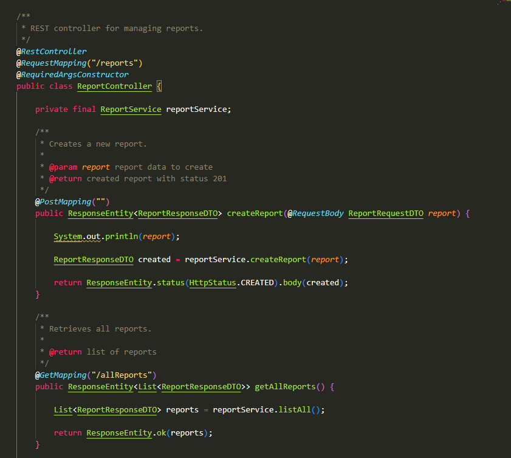
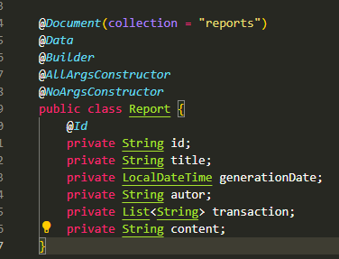
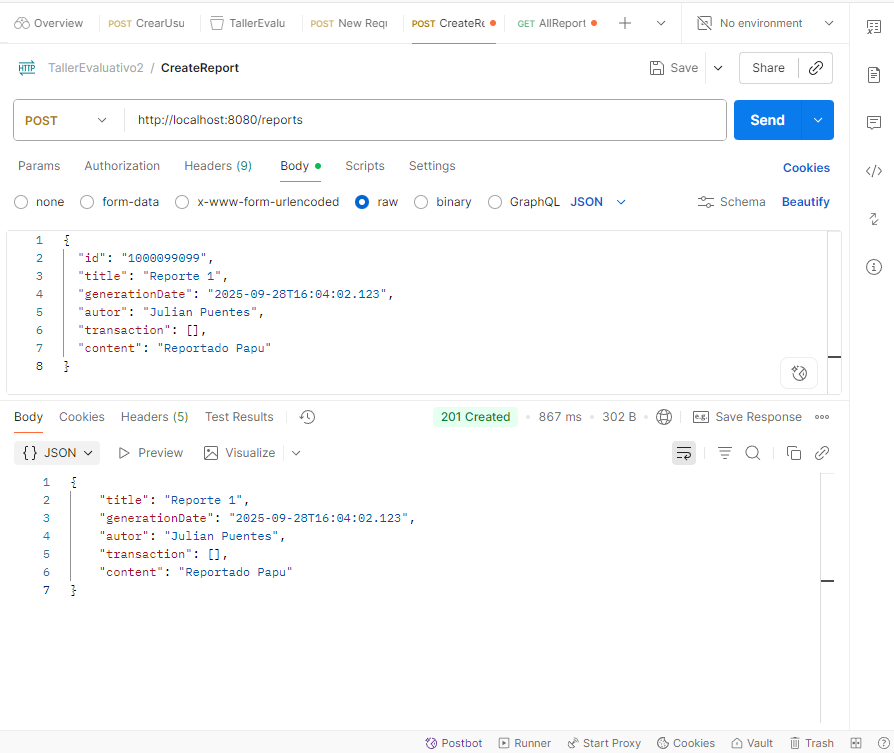
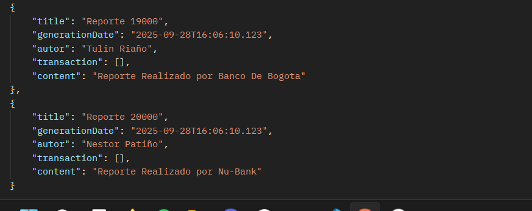

# Taller Evaluativo – Corte 2

## Integrantes

- Juan Sebastián Puentes Julio
- Daniel Patiño Mejía
- Tulio Riaño
- Néstor David López
- Julián López

---

## Descripción del enunciado

- Una empresa fintech quiere desarrollar un `Sistema de Reportes Financieros` que permita generar informes dinámicos y personalizables para sus clientes.

  El sistema debe permitir a los usuarios:

1. Crear reportes con información básica: título, fecha de generación, autor, lista de transacciones y contenido.
2. Extender dinámicamente los reportes con decoradores:
   - Reporte con gráficas.
   - Reporte con marcas de agua de seguridad.
   - Reporte con resumen estadístico.
   - Reporte con exportación a PDF/Excel.
3. Usar el `patrón Builder` para construir los objetos Reporte paso a paso, asegurando flexibilidad en su creación.
4. Listar todos los reportes generados y filtrar por fecha usando `Streams`.
5. Persistir los reportes en `MongoDB`.

---

## 🌲Ramificacion y Estrategia de Versionamiento de ramas

- Se realiza la respectiva ramificacion creando las ramas `develop` y `feature` para desarrollar las nuevas funcionalidades de la aplicacion. Para los commits manejamos el estandar `feat/modulo: Accion Realizada - Nombre Quien Lo Hizo` para que se entienda con claridad lo elaborado.

---

## 1. Diseño

### 📌 Diagrama de Componentes Específico

- Haciendo uso del componente del Controlador, donde se va a administrar las acciones que se pueden llegar a realizar los reportes empleamos un report service donde se encontrará la lógica de negocio respectiva para crear los reportes y encapsularle distintas funcionalidades, este servicio hace uso del repositorio para obtener todos los reportes que se encuentran guardados en la base de datos.

### 📌 Diagrama de Clases

.png>)

---

## 2. Descripción de como la solución sigue los principios SOLID

---

## 3. Implementación en código con SpringBoot y Mongo DB:

- El controlador mediante sus anotaciones va a poder crear nuevos documentos y así mismo obtenerlos todos.

- Para hacer uso de la persistencia mediante MongoDB, hacemos uso de las anotaciones `@Document` de igual forma se emplea un `repositorio` donde se van a generar las respectivas consultas y se van a guardar los datos.

---

## 4. **Swagger**

---

## 5. **MongoDB**

- Utilizando PostMan, podemos implementar peticiones Rest para generar tanto los reportes, como obtenerlo respectivamente.

## Petición Post:

## Petición Get:

