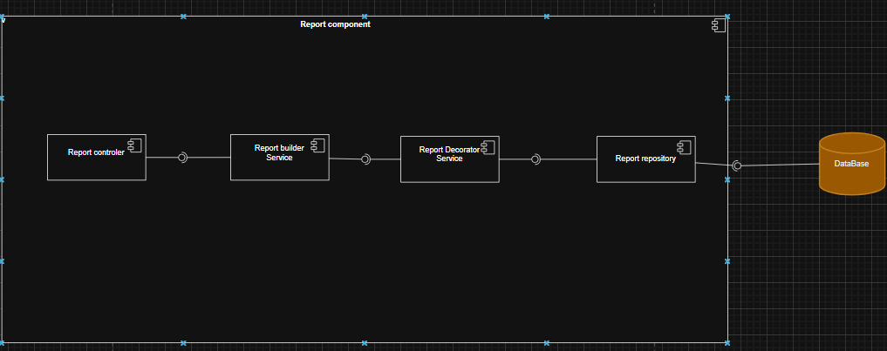
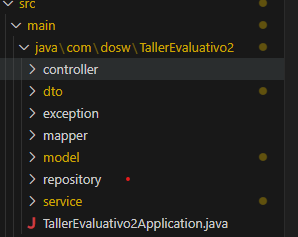
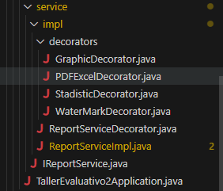

# Taller Evaluativo – Corte 2

## Integrantes
- Juan Sebastián Puentes Julio  
- Daniel Patiño Mejía  
- Tulio Riaño  
- Néstor David López  
- Julián López  
---
## 🌲Ramificacion y Estrategia de Versionamiento de ramas
- Se realiza la respectiva ramificacion creando las ramas `develop` y `feature` para desarrollar las nuevas funcionalidades de la aplicacion. Para los commits manejamos el estandar `feat/modulo: Accion Realizada - Nombre Quien Lo Hizo` para que se entienda con claridad lo elaborado.
---
## 1. Diseño

### 📌 Diagrama de Componentes General

### 📌 Diagrama de Componentes Específico

### 📌 Diagrama de Clases

---

## 2. Codificación

Para la codificación, basándonos en los **patrones de diseño** y en el **diagrama de clases**, decidimos tener la siguiente **estructura de carpetas**:  

En esta estructura se definen:  
- **Controller**: Controladores del proyecto.  
- **DTOs**: Clases de transferencia de datos.  
- **Exceptions**: Clases de excepciones personalizadas.  
- **Service**: Implementaciones de la lógica del negocio.  

En la carpeta `service` también se definen los **decorators**, que representan los diferentes tipos de reportes. Además, se encuentra la **interfaz de Reporte**, que como lo indica el patrón *Decorator*, es implementada por una **clase abstracta base**.  

### 📌 Ejemplo de Implementaciones

## 3.  **Swagger**

---

## 4.  **MongoDB**